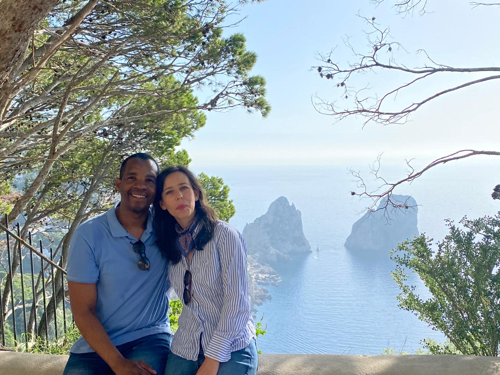
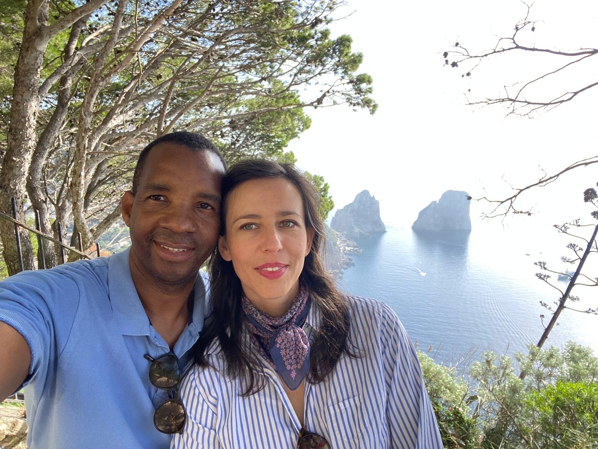
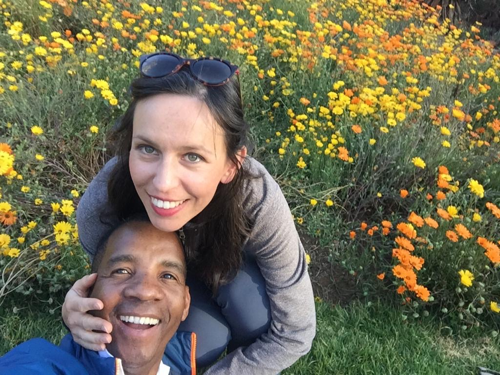

<!DOCTYPE html>
<html lang="en">
<head>
  <meta charset="UTF-8" />
  <meta name="viewport" content="width=device-width, initial-scale=1.0" />
  <title>Humbu & Ana Wedding</title>
  <link rel="preconnect" href="https://fonts.googleapis.com">
  <link rel="preconnect" href="https://fonts.gstatic.com" crossorigin>
  <link href="https://fonts.googleapis.com/css2?family=Cormorant+Garamond:wght@400;600;700&family=Montserrat:wght@300;400;500;600&display=swap" rel="stylesheet">
  <link rel="stylesheet" href="style.css" />
</head>
<body>
  <header class="nav">
    <a href="#home" class="logo">H & A</a>
    <nav>
      <a href="#celebration">Celebration</a>
      <a href="#details">Details</a>
      <a href="#gallery">Gallery</a>
      <a href="#rsvp">RSVP</a>
      <a href="#contact">Contact</a>
    </nav>
  </header>

  <section id="home" class="hero">
    

    

      
We are getting married · Ci sposiamo

      <h1>Humbu & Ana</h1>
      
26 September 2026 · Mantova, Italy

      

        
0<small>Days Giorni</small>

        
0<small>Hours Ore</small>

        
0<small>Minutes Minuti</small>

        
0<small>Seconds Secondi</small>

      

      <a href="#rsvp" class="btn">RSVP by 18 July 2026</a>
    

  </section>

  <main>
    <section class="intro section">
      
With love and joy · Con amore e gioia

      <h2>Join us as we celebrate our wedding day.</h2>
      
We would be honoured to have you with us as we begin this beautiful new chapter together.

      
Saremmo onorati di avervi con noi mentre iniziamo insieme questo bellissimo nuovo capitolo.

    </section>

    <section id="celebration" class="celebration section">
      

      

        

          
Our celebration · La nostra celebrazione

          <h2>Love, grace, family, and all things worth giving thanks for</h2>
          <h3>Amore, grazia, famiglia e tutto ciò per cui vale la pena rendere grazie</h3>
        

        

          

            
Our hearts are full of gratitude to God for love, for family, for friendship, and for the kindness that has carried us into this season. This celebration is our joyful thanksgiving to the Lord and a chance to gather the people we treasure most in one beautiful place.

            
We would love for you to come and witness as we officially celebrate our union before God and the people we hold dear. We pray the day feels warm, vibrant, elegant, and full of life, with laughter, thanksgiving, and unforgettable joy shared across generations.

            <blockquote>
              “Two are better than one, because they have a good reward for their labour... For if they fall, one will lift up his companion.”
              <cite>Ecclesiastes 4:9–10</cite>
            </blockquote>
          

          

            
I nostri cuori sono pieni di gratitudine verso Dio per l'amore, la famiglia, l'amicizia e per la bontà che ci ha accompagnati fino a questa stagione. Questa celebrazione è il nostro gioioso ringraziamento al Signore e un'occasione per riunire in un luogo meraviglioso le persone che più amiamo.

            
Saremmo felici di avervi con noi mentre celebriamo ufficialmente la nostra unione davanti a Dio e alle persone a noi care. Preghiamo che questo giorno sia caldo, vivace, elegante e pieno di vita, con risate, gratitudine e gioia indimenticabile condivisa tra generazioni.

            <blockquote>
              “Meglio essere in due che uno solo, perché vi è un buon compenso per la loro fatica... Infatti, se l'uno cade, l'altro rialza il compagno.”
              <cite>Ecclesiaste 4:9–10</cite>
            </blockquote>
          

        

      

    </section>

    <section id="details" class="section details">
      
Wedding programme · Programma del matrimonio

      <h2>Event Details</h2>
      

        <article class="card">
          <h3>Matrimonio civile / Official ceremony</h3>
          
11:00

          
<strong>Comune di Curtatone</strong> Provincia di Mantova, Italy

          <a class="map" href="https://www.google.com/maps/search/?api=1&query=Comune+di+Curtatone+Provincia+di+Mantova+Italy" target="_blank">Open map / Apri mappa</a>
        </article>
        <article class="card">
          <h3>Lunch / Pranzo</h3>
          
13:00

          
<strong>Cava Boschetto</strong> Str. Vicinale del Boschetto 1 46010 Curtatone, Mantova, Italy

          <a class="map" href="https://www.google.com/maps/search/?api=1&query=Cava+Boschetto+Str.+Vicinale+del+Boschetto+1+46010+Curtatone+Mantova+Italy" target="_blank">Open map / Apri mappa</a>
        </article>
        <article class="card">
          <h3>Dress Code / Abbigliamento</h3>
          
Elegant / Elegante

          
Please dress elegantly as we celebrate this special day together.

          
Vi chiediamo un abbigliamento elegante per celebrare insieme questo giorno speciale.

        </article>
      

    </section>

    <section class="quote section">
       <h2>“Two hearts, one journey.” <small>“Due cuori, un solo cammino.”</small></h2>
      
Humbu & Ana

    </section>

    <section id="gallery" class="section gallery">
      
Our memories · I nostri ricordi

      <h2>Gallery</h2>
      

        
        
        
      

    </section>

    <section id="rsvp" class="section rsvp">
      
Kindly respond · Gentile conferma

      <h2>RSVP</h2>
      
Please confirm your attendance by <strong>18 July 2026</strong>.

      
Si prega di confermare la presenza entro il <strong>18 luglio 2026</strong>.

      <form id="rsvpForm">
        <input type="text" id="fullName" placeholder="Full name / Nome e cognome" required>
        <select id="attendance" required>
          <option value="">Will you be attending? / Parteciperai?</option>
          <option value="Yes, with joy">Yes, with joy / Sì, con gioia</option>
          <option value="Regretfully No">Regretfully No / Purtroppo no</option>
        </select>
        <button type="submit" class="btn">Send RSVP / Invia RSVP</button>
      </form>
      
RSVP via WhatsApp: <strong>+27 79 750 6051</strong>

    </section>

    <section id="contact" class="section contact">
      
Need help? · Hai bisogno di aiuto?

      <h2>Contact</h2>
      
For RSVP or wedding enquiries, please contact:

      
Per RSVP o informazioni sul matrimonio, contattare:

      <a class="phone" href="tel:+447428454074">+44 (0)7428 454074</a>
    </section>
  </main>

  <footer>
    
Humbu & Ana · 26 September 2026

  </footer>

  
</body>
</html>
